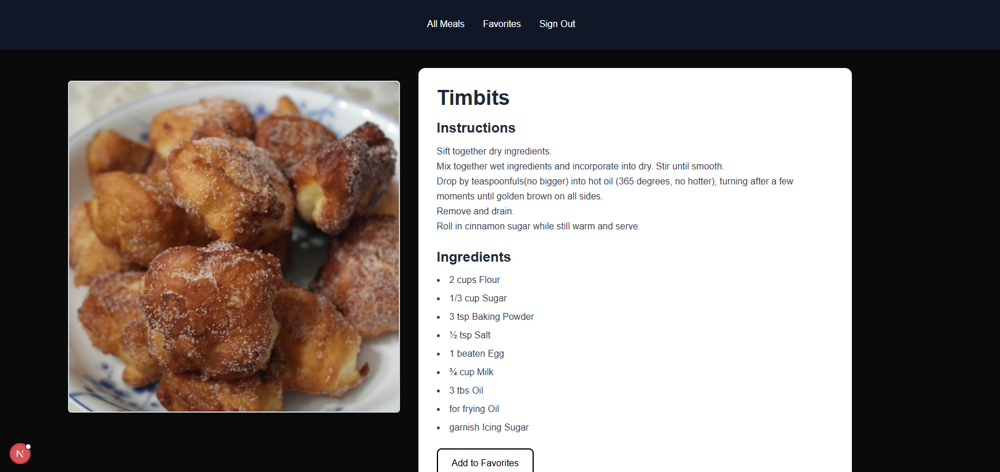

# Recipe Viewer

Welcome to the **Recipe Viewer** application, a Next.js-based web platform designed to manage and display recipes with user authentication. This project leverages modern web technologies and integrates with MongoDB for data storage, offering a seamless user experience.

## Project Overview

This application was developed as part of an internship project at Xobin, deployed on Vercel at `https://xobin-intern.vercel.app/`. It provides a secure environment for users to log in, view recipes, and manage their accounts, with a focus on robust authentication and database connectivity.

## Features

- **User Authentication**: Secure login and session management using NextAuth with Credentials provider.
- **Recipe Management**: Display and potentially manage recipes (expandable with additional CRUD functionality).
- **Responsive Design**: Built with Next.js for a responsive and fast user interface.
- **Database Integration**: Connected to MongoDB for persistent storage of user data.
- **Error Handling**: Comprehensive logging and error management for debugging and reliability.
- **Dynamic Deployment**: Supports dynamic URLs via Vercel, adapting to preview and production environments.

## Technologies Used

- **Framework**: Next.js
- **Authentication**: NextAuth
- **Database**: MongoDB
- **Deployment**: Vercel
- **Language**: TypeScript
- **Styling**: CSS (expandable with Tailwind or other libraries)

## Installation

1. Clone the repository:
   ```bash
   git clone https://github.com/your-username/recipe-viewer.git
   cd recipe-viewer

2. ```bash
    npm install

3. Set env
    ```bash 
    NEXTAUTH_SECRET="your-random-secret-here"
    MONGODB_URI="mongodb+srv://<username>:<password>@<cluster>.mongodb.net/<database>?retryWrites=true&w=majority"
4. Run the server
    ```bash 
    npm run dev

## Endpoints

This section details the API endpoints implemented in the **Recipe Viewer** application, focusing on authentication and user interface rendering. These endpoints are built using NextAuth with a Credentials provider and integrated with Next.js routing.

- **`/api/auth/[...nextauth]`**
  - **Methods**: `GET`, `POST`
  - **Purpose**: Handles authentication callbacks, session management, user login, logout, and session updates. This is the core endpoint for NextAuth, processing credential-based authentication and JWT session strategies.
  - **Implementation**: Utilizes `NextAuth` with a custom `authOptions` object in `app/api/auth/[...nextauth]/route.ts`. The `CredentialsProvider` authorizes users by connecting to MongoDB via `connectToDatabase` in `lib/mongodb.ts`, validating credentials with `bcrypt`, and managing sessions with JWT callbacks. Logging is added for debugging (e.g., `console.log` in `authorize` and `callbacks`).
  - **Example**: `POST https://xobin-intern.vercel.app/api/auth/callback/credentials` for credential-based login.

- **`/login`**
  - **Method**: `GET`
  - **Purpose**: Renders the login page, providing a user interface for entering email and password credentials.
  - **Implementation**: Defined as a page route in Next.js (e.g., `app/login/page.tsx`). It includes a form that submits credentials to the `/api/auth/[...nextauth]` endpoint via NextAuth's `signIn` function, with the login page configured in `authOptions.pages.signIn = '/login'`.
  - **Example**: `GET https://xobin-intern.vercel.app/login` to access the login UI.

- **`/api/auth/callback/credentials`**
  - **Method**: `POST`
  - **Purpose**: Serves as the callback endpoint for authentication responses, processing the result of the credential-based login attempt and redirecting the user accordingly.
  - **Implementation**: Handled automatically by NextAuth as part of the `/api/auth/[...nextauth]` route. The callback URL is dynamically set in `authOptions` using `process.env.NEXTAUTH_URL` or `process.env.VERCEL_URL` for production and preview environments, respectively. Errors (e.g., 401 Unauthorized) are logged and may stem from MongoDB connection issues (e.g., `MongoServerSelectionError`).
  - **Example**: `POST https://xobin-intern.vercel.app/api/auth/callback/credentials` after submitting login credentials.

## Project Structure

This section outlines the directory and file structure of the **Recipe Viewer** application, designed with Next.js . The structure supports authentication, MongoDB integration, and a scalable architecture. Below is the project layout in Bash format, generated as of 12:46 PM IST on Saturday, July 19, 2025.


```bash
recipe-viewer/
├── .env.local              # Local environment variables (e.g., NEXTAUTH_SECRET, MONGODB_URI)
├── .gitignore              # Git ignore file
├── README.md               # Project documentation
├── package.json            # Node.js dependencies and scripts
├── tsconfig.json           # TypeScript configuration
├── next.config.js          # Next.js configuration (if customized)
├── public/                 # Static files where icons and screenshots are stored
│      
├── app/                    # Next.js app directory
│   ├── api/                # API routes
│   │   ├── auth/                # Authentication routes
│   │   │   └── [...nextauth]    # Catch-all route for NextAuth
│   │   │        ├── route.ts  
                 └── auth.ts            # Authentication logic and options
│   ├── layout.tsx          # Root layout for the app
│   ├── page.tsx            # Home page
│   ├── login/              # Login page
│   │   └── page.tsx        # Login UI and form
│   └── ...                 # Other pages (e.g., recipe list favorite)
├── lib/                    # Utility functions
│   └── mongodb.ts          # MongoDB connection logic
├── styles/                 # CSS or global styles
│   └── globals.css         # Global CSS file
└── node_modules/           # Dependency directory (generated by npm)


## Features

This section highlights the key features of the **Recipe Viewer** application, developed as a Next.js-based web platform with MongoDB integration and deployed at `https://xobin-intern.vercel.app/`.

- **User Authentication**: Secure login and session management using NextAuth with a Credentials provider, ensuring user data is protected and sessions are maintained across interactions.
- **Recipe Management**: Displays recipes with potential for future CRUD (Create, Read, Update, Delete) functionality, providing a foundation for recipe viewing and management.
- **Random Recipe Generator**: Generates a random recipe on the home page, offering users a quick and fun way to discover new recipes.
- **Search Function**: Includes a search bar on the home page to filter recipes by name or ingredients, enhancing user navigation.
- **Responsive Design**: Built with Next.js, offering a responsive and fast user interface adaptable to various devices and screen sizes.
- **Database Integration**: Connected to MongoDB for persistent storage of user data, enabling reliable data retrieval and management.
- **Error Handling**: Implements comprehensive logging and error management for debugging and ensuring application reliability.
- **Dynamic Deployment**: Supports dynamic URLs via Vercel, seamlessly adapting to production and preview environments for testing and deployment.


## Project link

[Deployed website in vercel](https://meal-app-nine-nu.vercel.app/signup)

### screenshots of project

#Login


#Home


#favorite


#recipe
